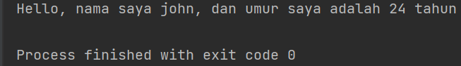

# String

- Berikut ini adalah ss latihan string beserta penjelasannya.

- Ini adalah ss output dari latihan string yang dimulai dari baris pertama.

- Pada soal latihan diperintahkan untuk melengkapi umur pada string. Berikut adalah code program dan outputnya.

